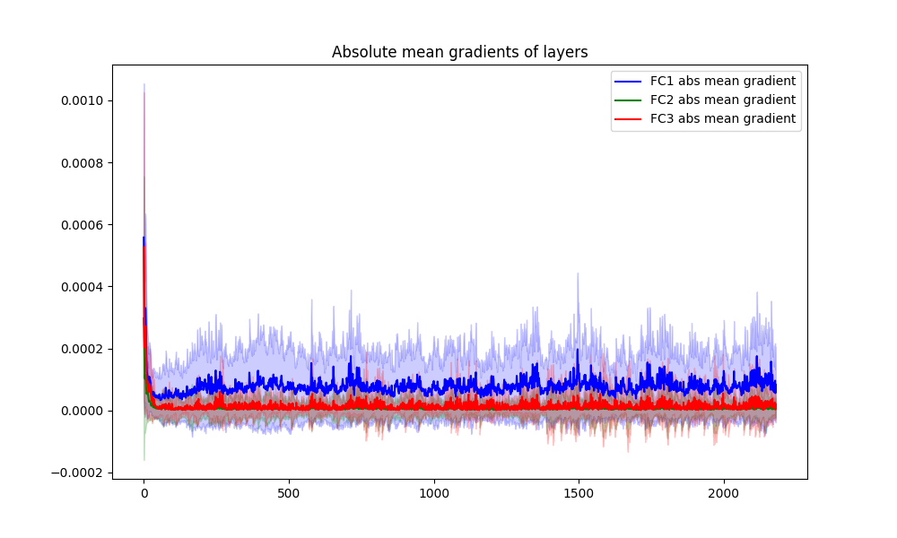
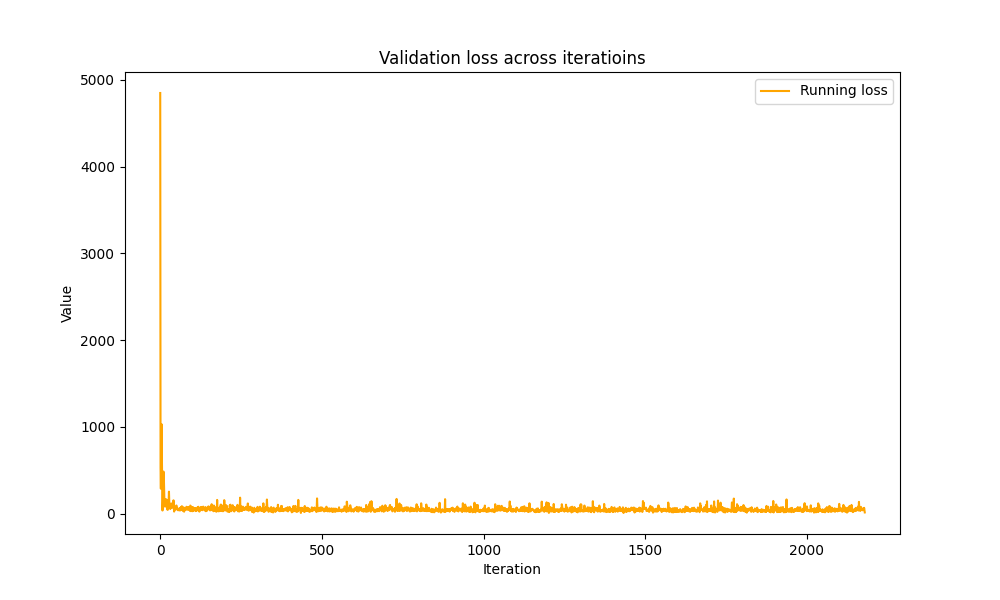
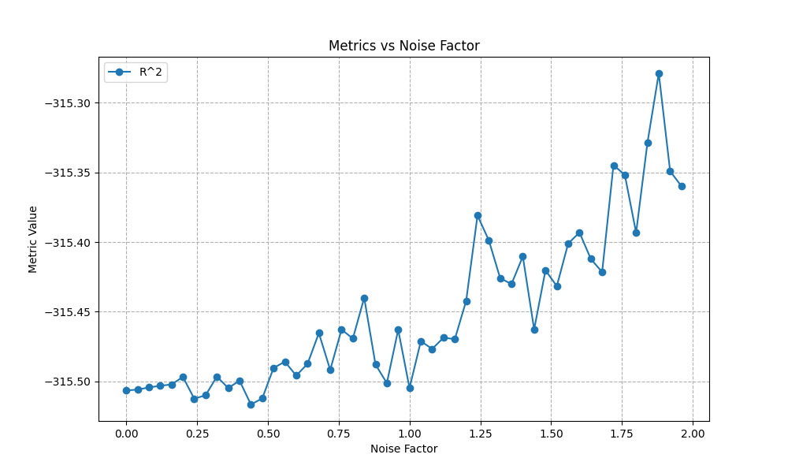

# Log

## Fri 18 Oct

### [Editing Python in Visual Studio Code](https://code.visualstudio.com/docs/python/editing) | code.visualstudio.com/docs

- [isort](https://marketplace.visualstudio.com/items?itemName=ms-python.isort),
  [Ruff](https://marketplace.visualstudio.com/items?itemName=charliermarsh.ruff)
- `numpy` as `np`, `tensorflow` as `tf`, `pandas` as `pd`, `matplotlib.pyplot`
  as `plt`, `matplotlib` as `mpl`, `math` as `m`, `scipi.io` as `spio`, and
  `scipy` as `sp`, `panel` as `pn`, `holoviews` as `hv`

- `> Organize Imports`
- Keys
  - <kbd>F12</kbd> — Go to Definition
  - <kbd>⌥F12</kbd> — Peek definition

- [PyLance](https://marketplace.visualstudio.com/items?itemName=ms-python.vscode-pylance)
  — language server

- [Pyright](https://github.com/microsoft/pyright) — static type checker

  - [Pyright playground](https://pyright-play.net/?code=MQAgKgFglgziMEMC2AHANgUxAEw0g9gHYwAuATgiRnBPgO4gDG%2BSBhIGZZ%2BZcjC7AEZZcVRlWzwSlKPzRoAniEFKUCslADmEEgDoAUPtwAzEAmzYAFAA8AXCGNp8lADQgF9x85IBKW-pBAkDIMEgBXMnZrEABqd0NQAAUEGBgoQk0zKTIQdNIBRiwUkBIILBgMZkJJBDJNMKQMQhJg6jC0Ejh0rLIw5qhGjmtClBIoIgNzKwBGNwAiOZ99IA)
  - [Stub Files](https://typing.readthedocs.io/en/latest/spec/distributing.html#stub-files)
    (?) — .pyi
  - [Writing and Maintaining Stub Files](https://typing.readthedocs.io/en/latest/guides/writing_stubs.html#writing-stubs)

- [VS Code's Python Extension](https://code.visualstudio.com/docs/python/editing)
  - [Code analysis settings](https://code.visualstudio.com/docs/python/settings-reference#_code-analysis-settings)
  - [Autocomplete settings](https://code.visualstudio.com/docs/python/settings-reference#_autocomplete-settings)
  - Provides autocomplete and IntelliSense for all files within the current
    working folder
  - It counts how often you use certain symbols
  - Enables a minimum set of features
  - Customizable analysis engine
  - Auto imports: `python.analysis.autoImportCompletions: true` (disabled by
    default)
  - Custom package locations:

```python
"python.analysis.extraPaths": [
    "~/.local/lib/Google/google_appengine",
    "~/.local/lib/Google/google_appengine/lib/flask-0.12"
]
```

- Copilot ad

### [importResolveFailure](https://code.visualstudio.com/docs/python/editing#_importresolvefailure) | code.visualstudio.com/docs

This error happens when Pylance is unable to find the package or module you're
importing, nor its type stubs.

**How to fix it**

- If you are importing a module, make sure it exists in your workspace or in a
  location that is included in the `python.autoComplete.extraPaths` setting.
- If you are importing a package that is not installed, you can install it by
  running the following command in an activated terminal:
  `python -m pip install {package_name}`.
- If you are importing a package that is already installed in a different
  interpreter or kernel,
  [select the correct interpreter](https://code.visualstudio.com/docs/python/environments#_select-and-activate-an-environment).
- If you are working with an editable install and it is currently set up to use
  import hooks, consider switching to using `.pth` files that only contain file
  paths instead, to enhance compatibility and ensure smoother import behavior.
  [Learn more in the Pyright documentation](https://microsoft.github.io/pyright/#/import-resolution?id=editable-installs).

> Мне кажется, установка Pylance решила все мои проблемы.

## Sun 20 Oct

### [Значение расширения .pyi в Python и его содержимого](https://ru.stackoverflow.com/questions/1012021/%D0%97%D0%BD%D0%B0%D1%87%D0%B5%D0%BD%D0%B8%D0%B5-%D1%80%D0%B0%D1%81%D1%88%D0%B8%D1%80%D0%B5%D0%BD%D0%B8%D1%8F-pyi-%D0%B2-python-%D0%B8-%D0%B5%D0%B3%D0%BE-%D1%81%D0%BE%D0%B4%D0%B5%D1%80%D0%B6%D0%B8%D0%BC%D0%BE%D0%B3%D0%BE) | ru.stackoverflow.com

`.pyi` файлы - это стабы (stubs), их назначение и формат описаны в PEP 484. Эти
файлы вообще никак не используются интерпретатором, их назначение -
предоставлять информацию о типизации кода. К примеру, у тебя есть сторонний
модуль без типизации, который не твой, редактировать его ты не можешь, а
прописать типы хотелось бы:

```python
# fizz.py
def greet(who):
    return f'Hello {who}'
```

Выход находится с помощью стаба: создаешь файл `fizz.pyi`, который содержит
типизированную сигнатуру `greet` без имплементации:

```python
# fizz.pyi
def greet(who: str) -> str:
    ...
```

Теперь утилиты статической типизации типа `mypy` или автодополнение кода в
Pycharm знают, где найти типизацию для функции `greet`.

### Что-то про Torch

```python
>>> torch.ones(8)
tensor([1., 1., 1., 1., 1., 1., 1., 1.])
```

```python
>>> torch.bernoulli(torch.ones(8) * 0.5)
tensor([1., 0., 1., 1., 1., 0., 1., 1.])
```

```python
>>> torch.bernoulli(torch.ones(8) * 0.5)
tensor([1., 0., 1., 1., 0., 1., 1., 0.])
```

```python
>>> torch.bernoulli(torch.ones(8) * 0.1)
tensor([0., 0., 0., 0., 0., 0., 0., 0.])
```

```python
>>> torch.bernoulli(torch.ones(8) * 0.1)
tensor([0., 1., 0., 1., 0., 0., 0., 0.])
```

### [Tensor.expand](https://pytorch.org/docs/stable/generated/torch.Tensor.expand.html) | pytorch.org

```python
Tensor.expand(*sizes) → Tensor
```

Returns a new view of the `self` tensor with singleton dimensions expanded to a
larger size.

```python
>>> x = torch.tensor([[1], [2], [3]])
>>> x.size()
torch.Size([3, 1])
>>> x.expand(3, 4)
tensor([[ 1,  1,  1,  1],
        [ 2,  2,  2,  2],
        [ 3,  3,  3,  3]])
>>> x.expand(-1, 4)   # -1 means not changing the size of that dimension
tensor([[ 1,  1,  1,  1],
        [ 2,  2,  2,  2],
        [ 3,  3,  3,  3]])
```

### [torch.unsqueeze](https://pytorch.org/docs/stable/generated/torch.unsqueeze.html) | pytorch.org

```python
torch.unsqueeze(input, dim) → Tensor
```

Returns a new tensor with a dimension of size one inserted at the specified
position.

```python
>>> x = torch.tensor([1, 2, 3, 4])
>>> torch.unsqueeze(x, 0)
tensor([[ 1,  2,  3,  4]])
>>> torch.unsqueeze(x, 1)
tensor([[ 1],
        [ 2],
        [ 3],
        [ 4]])
```

### [torch.squeeze](https://pytorch.org/docs/stable/generated/torch.squeeze.html#torch.squeeze) | pytorch.org

```python
torch.squeeze(input, dim: int | tuple[int, int, ...int] = None) → Tensor
```

Returns a tensor with all specified dimensions of input of size 1 removed.

For example, if _input_ be of shape
$(A \times 1 \times B \times C \times 1 \times D)$, then output be of shape
$(A \times B \times C \times D)$.

**BUT** if `dim` is given, then a squeeze operation is done only in the given
dimension(s).

Example:

```python
>>> x = torch.zeros(2, 1, 2, 1, 2)
>>> x.size()
torch.Size([2, 1, 2, 1, 2])
>>> y = torch.squeeze(x)
>>> y.size()
torch.Size([2, 2, 2])
>>> y = torch.squeeze(x, 0)
>>> y.size()
torch.Size([2, 1, 2, 1, 2])
>>> y = torch.squeeze(x, 1)
>>> y.size()
torch.Size([2, 2, 1, 2])
>>> y = torch.squeeze(x, (1, 2, 3))
torch.Size([2, 2, 2])
```

### `*.__class__.__name__.` в Python

Эта красивая штука работает вообще для всего:

```python
>>> (1).__class__.__name__
'int'
>>> (None).__class__.__name__
'NoneType'
>>> (str).__class__.__name__
'type'
>>> (print).__class__.__name__
'builtin_function_or_method'
```

Текст можно писать прямо в превью!

- [PrinceXML](https://www.princexml.com/) - "Convert HTML to PDF: USD $2000 per"
- [Bibliographies and citations](https://shd101wyy.github.io/markdown-preview-enhanced/#/pandoc-bibliographies-and-citations) - Pandoc bibliographies and citations

```yaml
---
title: "Important document"
output: pdf_document
bibliography: bibliography.bib
# Или даже:
bibliography: [bibliography1.bib, bibliography2.bib]
---
```

Поддерживается:

| Format      | File extension |
| ----------- | -------------- |
| BibLaTeX    | .bib           |
| BibTeX      | .bibtex        |
| Copac       | .copac         |
| CSL JSON    | .json          |
| CSL YAML    | .yaml          |
| EndNote     | .enl           |
| EndNote XML | .xml           |
| ISI         | .wos           |
| MEDLINE     | .medline       |
| MODS        | .mods          |
| RIS         | .ris           |

### Converting back and forth between .py and .ipynb

```bash
(.venv) 127     JupyterNotebooksλ ~/.venv/bin/jupytext --to notebook hypertrain5.py
[jupytext] Reading hypertrain5.py in format py
[jupytext] Writing hypertrain5.ipynb (destination file replaced [use --update to preserve cell outputs and ids])

$ jupyter nbconvert --to script hypertrain5.ipynb
```

### Расширяем diagonal_mask

```python
diagonal_mask = diagonal_mask.expand(grad_output.size(1), -1).t()
```

```
Exception has occurred: RuntimeError
The expanded size of the tensor (1024) must match the existing size (12) at non-singleton dimension 0.  Target sizes: [1024, -1].  Tensor sizes: [12, 12]
  File "/Users/scales/JupyterNotebooks/hypertrain5.py", line 370, in backward
    diagonal_mask = diagonal_mask.expand(grad_output.size(1), -1).t()
                    ^^^^^^^^^^^^^^^^^^^^^^^^^^^^^^^^^^^^^^^^^^^^^
  File "/Users/scales/JupyterNotebooks/hypertrain5.py", line 520, in train
    loss.backward()
  File "/Users/scales/JupyterNotebooks/hypertrain5.py", line 608, in <module>
    train(
RuntimeError: The expanded size of the tensor (1024) must match the existing size (12) at non-singleton dimension 0.  Target sizes: [1024, -1].  Tensor sizes: [12, 12]
```

:c

Пробуем что-то другое

```
diagonal_mask = diagonal_mask.unsqueeze(1).expand(-1, grad_output.size(1), -1)
diagonal_mask = diagonal_mask.permute(0, 2, 1)

grad_output = grad_output.unsqueeze(1) * diagonal_mask
grad_output = grad_output.sum(dim=1)
```

Запускаем

```
grad_output shape: torch.Size([12, 1024])
diagonal_mask shape: torch.Size([12, 12, 1024])

Exception has occurred: RuntimeError
mat2 must be a matrix
  File "/Users/scales/JupyterNotebooks/hypertrain5.py", line 380, in backward
    grad_output = grad_output.mm(diagonal_mask)
                  ^^^^^^^^^^^^^^^^^^^^^^^^^^^^^
  File "/Users/scales/JupyterNotebooks/hypertrain5.py", line 525, in train
    loss.backward()
  File "/Users/scales/JupyterNotebooks/hypertrain5.py", line 613, in <module>
    train(
RuntimeError: mat2 must be a matrix
```

Одно измерение лишнее…

Там была одна лишняя строчка, попробую ещё раз







По сравнению с предыдущей итерацией:

- MSE падает, а не растёт
- $R^2$ растёт, а не падает

По определению
([Коэффициент детерминации](https://ru.wikipedia.org/wiki/%D0%9A%D0%BE%D1%8D%D1%84%D1%84%D0%B8%D1%86%D0%B8%D0%B5%D0%BD%D1%82_%D0%B4%D0%B5%D1%82%D0%B5%D1%80%D0%BC%D0%B8%D0%BD%D0%B0%D1%86%D0%B8%D0%B8)):

$$
R^2 = 1 - \frac{D[y|x]}{D[y]}
$$

- $D[y] = \sigma_y^2$ — дисперсия случайной величины (разницы между фактическими
  и предсказанными значениями)
- $D[y|x] = \sigma^2$ — дисперсия ошибки модели

План дальше:

- [x] Поменять гиперпараметры??
- [ ] Проверить на новых данных (_??_)
- [ ] Анализ графика регрессионных остатков (_??_)

## Fri 8 Nov

> 'Axes' object has no attribute 'xlabel'
> 'Axes' object has no attribute 'xscale'

### [matplotlib.axes.Axes](https://matplotlib.org/stable/api/_as_gen/matplotlib.axes.Axes.html#matplotlib.axes.Axes) | matplotlib.org

```python
def matplotlib.axes.Axes(
  fig,
  *args,
  facecolor=None,
  frameon=True,
  sharex=None,
  sharey=None,
  label='',
  xscale=None,
  yscale=None,
  box_aspect=None,
  forward_navigation_events='auto',
  **kwargs
)
```

> An Axes object encapsulates all the elements of an individual (sub-)plot in a
> figure.
>
> It contains most of the (sub-)plot elements: Axis, Tick, Line2D, Text,
> Polygon, etc., and sets the coordinate system.
>
> Like all visible elements in a figure, Axes is an Artist subclass.

То есть _Axes_ это такой кусок графика… Поэтому у него нет `.set_xscale()`.

Потому что скорее всего `.set_xscale()` мы будем вызывать на `fig`?

### [matplotlib.pyplot.subplots](https://matplotlib.org/stable/api/_as_gen/matplotlib.pyplot.subplots.html) | matplotlib.org

```python
matplotlib.pyplot.subplots(
  nrows=1, 
  ncols=1, 
  *, 
  sharex=False, sharey=False, squeeze=True, width_ratios=None, 
  height_ratios=None, subplot_kw=None, gridspec_kw=None, **fig_kw
) -> (Figure, Axes)
```

### [matplotlib.figure.Figure](https://matplotlib.org/stable/api/_as_gen/matplotlib.figure.Figure.html#matplotlib.figure.Figure) | matplotlib.org

```python
class matplotlib.figure.Figure(
  figsize=None, dpi=None, *,
  facecolor=None, edgecolor=None, linewidth=0.0, frameon=None, 
  subplotpars=None, tight_layout=None, constrained_layout=None, 
  layout=None, **kwargs
)
```

> The top level container for all the plot elements.
>
> See [matplotlib.figure](https://matplotlib.org/stable/api/figure_api.html#module-matplotlib.figure) for an index of class methods.

### [matplotlib.figure](https://matplotlib.org/stable/api/figure_api.html#module-matplotlib.figure) | matplotlib.org

> 'Axes' object has no attribute 'xlabel'
> 'Axes' object has no attribute 'xscale'

- Мне нужен Figure.savefig?

- Мне точно нужны [matplotlib.axes.Axes.set_xlabel](https://matplotlib.org/stable/api/_as_gen/matplotlib.axes.Axes.set_xlabel.html#matplotlib.axes.Axes.set_xlabel)
  и [matplotlib.axes.Axes.set_xscale](https://matplotlib.org/stable/api/_as_gen/matplotlib.axes.Axes.set_xscale.html#matplotlib.axes.Axes.set_xscale)

### [matplotlib.artist](https://matplotlib.org/stable/api/artist_api.html#matplotlib.artist.Artist) | matplotlib.org

```
Artist.Tick.XTick.ThetaTick
      :    .YTick.RadialTick
      .Patch.FancyArrowPatch.ConnectionPatch
      :     .FancyBboxPatch
      .Collection
```

## Tue 19 Nov

### [GridSearchCV](https://scikit-learn.org/stable/modules/generated/sklearn.model_selection.GridSearchCV.html) | scikit-learn.org

CV means "cross-validation".

```python
class sklearn.model_selection.GridSearchCV(
  # Must implement the scikit-learn estimator interface
  estimator,
   # { parametersName: list[parameterValue] } or a list
   # of such dictionaries, in which case the grids spanned
   # by each dictionary in the list are explored.
   # This enables searching over any sequence of parameter settings.
  param_grid,
  *,
  # If single score: string | (???) -> metricScore
  # If multiple score: list[string],
  #                or  tuple[string, ..., string],
  #                or  (???) -> dict[metricName :to metricScore],
  #                or  dict[metricName :to () -> metricScore] # I think so?
  scoring=None,
  n_jobs=None,
  refit=True,
  cv=None,
  verbose=0,
  pre_dispatch='2*n_jobs',
  error_score=nan,
  return_train_score=False
)
```

I want :keywords in Python. Can I have them?

Grid search workflow:


## Wed 20 Nov

### [GraniteMoe](https://huggingface.co/docs/transformers/model_doc/granitemoe) | huggingface.co/docs

> Recent studies propose using small proxy models and small corpus to perform hyperparameter searches and transposing the optimal parameters to large models and large corpus.

### [readline — GNU readline interface](https://docs.python.org/3/library/readline.html) |  docs.python.org

> Readline keybindings may be configured via an initialization file, typically .inputrc in your home directory.

Vi mode, tab completion in python:

```inputrc
python:bind -v 
python:bind ^I rl_complete
```

### [SageMath](https://www.sagemath.org/) | sagemath.org

> SageMath is a free [open-source](https://github.com/sagemath/sage/) mathematics software system licensed under the GPL. It builds on top of many existing open-source packages: NumPy, SciPy, matplotlib, Sympy, [Maxima](https://maxima.sourceforge.io/), [GAP](https://www.gap-system.org/)¹, [FLINT](https://flintlib.org/)², R and [many more](https://doc.sagemath.org/html/en/reference/spkg/).  Access their combined power through a common, Python-based language or directly via interfaces or wrappers.
>
> ¹ Groups, Algorithms, Programming - A System for Computational Discrete Algebra
> ² Fast Library for Number Theory

* Latest release: [SageMath 10.4 - v2.4.0](https://github.com/3-manifolds/Sage_macOS/releases/tag/v2.4.0)

### [List of resources for learning Category Theory](https://pythonrepo.com/repo/bgavran-Category_Theory_Resources-python-miscellaneous) | pythonrepo.com

>  Last update: Jan 1, 2023

Books:

- [Seven Sketches in Compositionality: An Invitation to Applied Category Theory](https://arxiv.org/abs/1803.05316) by Fong, Spivak | arxiv.org
- [Conceptual Mathematics: A First Introduction to Categories](https://s3.amazonaws.com/arena-attachments/325201/2ff932bf546d8985eb613fccf02b69c7.pdf) by Schanuel, Lawvere | s3.amazonaws.com, PDF
- [Category theory for Programmers](https://github.com/hmemcpy/milewski-ctfp-pdf/) by Milewski | github.com/hmemcpy
- [Polynomial Functors: A General Theory of Interaction](https://topos.site/poly-book.pdf) by Spivak, Niu | [topos.site](https://topos.site) - Topos Institute
- [Draft of "Categorical Systems Theory"](http://davidjaz.com/Papers/DynamicalBook.pdf) by Jaz Myers | davidjaz.com
- [Category theory for the Sciences](https://mitpress.mit.edu/books/category-theory-sciences) by Spivak | mitpress.mit.edu
- [What is Applied Category Theory?](https://arxiv.org/abs/1809.05923) by Bradley | arxiv.org

Video lectures:

- [Bartosz Milewski's video lectures](https://www.youtube.com/watch?v=I8LbkfSSR58&list=PLbgaMIhjbmEnaH_LTkxLI7FMa2HsnawM_) | youtube.com
- [The Catsters](https://www.youtube.com/user/TheCatsters) | youtube.com
- [Applied Category Theory at Topos Institute](https://www.youtube.com/watch?v=UusLtx9fIjs&list=PLhgq-BqyZ7i5lOqOqqRiS0U5SwTmPpHQ5) | youtube.com
- [Programming with Categories](https://www.youtube.com/watch?v=NUBEB9QlNCM) | youtube.com

Blog posts:

- [What is category theory, anyway?](https://www.math3ma.com/blog/what-is-category-theory-anyway) | math3ma.com
- [On compositionality](https://pythonrepo.com/repo/bgavran-Category_Theory_Resources-python-miscellaneous) | pythonrepo.com
- (examined below) [From design patterns to category theory](https://blog.ploeh.dk/2017/10/04/from-design-patterns-to-category-theory/) | blog.ploeh.dk

### [From design patterns to category theory](https://blog.ploeh.dk/2017/10/04/from-design-patterns-to-category-theory/) | blog.ploeh.d

> *How do you design good abstractions? By using abstractions that already exist.*

> "Abstraction is the elimination of the irrelevant and the amplification of the essential"
> — Robert C. Martin:

> I don't know how to solve the *prior knowledge* requirement, other than to tell you to study.

> I think a good abstraction should also be *intuitive*. What's the most intuitive abstractions ever? **Mathematics.** <!-- emphasis mine-->

Links to cool maths:

- [Differential topology](https://en.wikipedia.org/wiki/Differential_topology) | en.wikipedia.org
- [Stochastic calculus](https://en.wikipedia.org/wiki/Stochastic_calculus) | en.wikipedia.org

Interesting conjecture:

> **Mathematics is** a big structure, but it's all **based on intuitive axioms**. Mathematics is intuitive. <!-- emphasis mine-->

[Domain-Driven Design](http://amzn.to/WBCwx7) says:

> …*Closure of Operations* ~~what?~~ leads to object models reminiscent of arithmetic.

Like OOP, category theory is concerned with *objects*. Morphisms map objects to objects.

**Suggestion.** Any mathematical object can be described in terms of category theory and analyzed as such. Therefore category theory is the universal tool for analyzing mathematical objects. Therefore, *very valuable* to learn.

## Thu 21 Nov 

### [Mathematical Thinking Isn’t What You Think It Is](https://www.quantamagazine.org/mathematical-thinking-isnt-what-you-think-it-is-20241118/) | quantamagazine.org

> According to Bessis, however, the way math is taught in school emphasizes the logic-based part of this process, when the more important element is **intuition**. <!-- emphasis mine -->

> Math should be thought of as a dialogue between the two: **between reason and instinct**, between language and abstraction. <!-- emphasis mine -->

> The mathematician’s message is for everyone: **Look at what you can do if you don’t give up on your intuition**. <!-- emphasis mine -->

> What we can learn from Descartes, Grothendieck and Thurston is that the nature of the **mathematical process is not what people think**. <!-- emphasis mine -->

> At its core, Bessis says, mathematics is a game of back-and-forth between intuition and logic, instinct and reason.

- intuition
- logic
- instinct
- reason

$$
\mathrm{Mathematics} := \mathrm{Game}_{<BackAndForth>}(\mathrm{players:} I, L, i, R)
$$

Utility function is our understanding? It can be quantified. Let $U$ be level of understanding, whatever that means.

Goal: improve mathematical intuition

> ...**easy math is actually deep math that you’ve internalized.** <!-- emphasis mine -->

> Math is hard. But life, whatever you do, is extremely hard.

> Bessis is inspired by the practices of mathematical greats like Bill Thurston, Alexander Grothendieck and René Descartes.

- Maybe research these people?

> **Whenever you spot a disconnect between what your gut is telling you and what is supposed to be rational, it’s an important opportunity to understand something new.**

> When you do math, you’re exposed to the human thought process in a way that is really pure. It’s not just about understanding things, but about understanding things in a very childish, deep, naïve, super clear, obvious way.

What a great article, I award it 10/10⭐️

It inspires us to do math

### Thinking

But what is the difference between logic and reason?

**logic** | ˈlɒdʒɪk |
noun [mass noun]
- reasoning conducted or assessed according to strict principles of validity: experience is a better guide to this than deductive logic | the logic of the argument is faulty.
- a particular system or codification of the principles of proof and inference: Aristotelian logic.
- the systematic use of symbolic and mathematical techniques to determine the forms of valid deductive argument.
- the quality of being justifiable by reason: there seemed to be a lack of logic in his remarks.
- (the logic of) the course of action suggested by or following as a necessary consequence of: the logic of private competition was to replace small firms by larger firms.

**reason** | ˈriːzn |
noun [mass noun]
- the power of the mind to think, understand, and form judgements logically: there is a close connection between reason and emotion.
- what is right, practical, or possible; common sense: people are willing, within reason, to pay for schooling.
- (one's reason) one's sanity: she is in danger of losing her reason.

Reason forms new thoughts, logic validates them?


